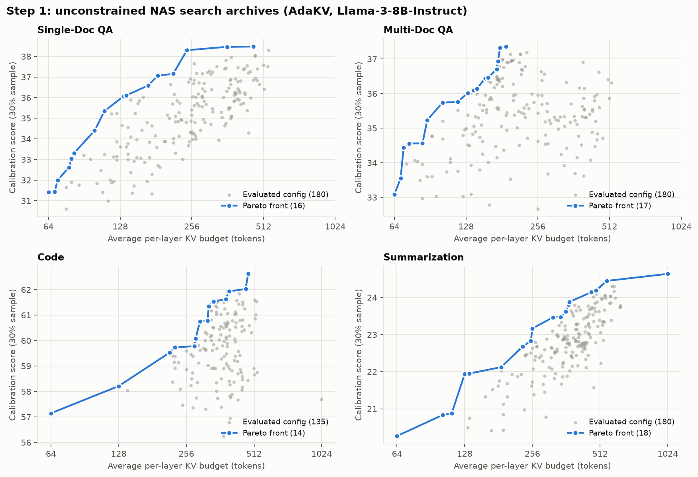
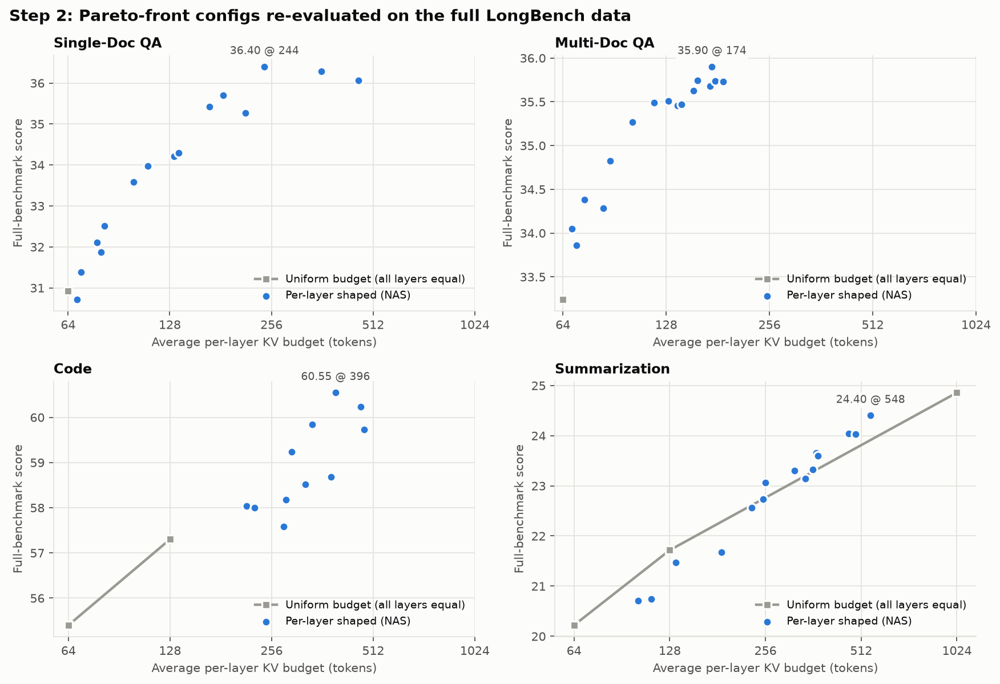
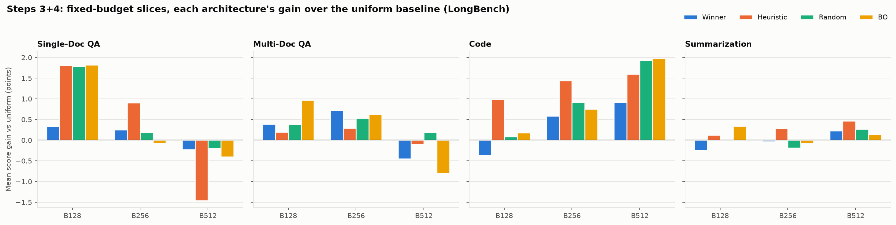
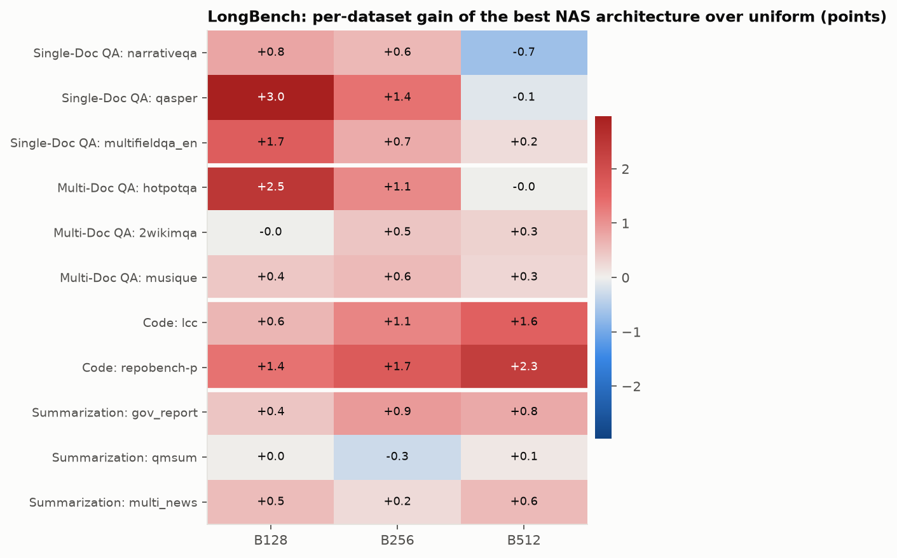
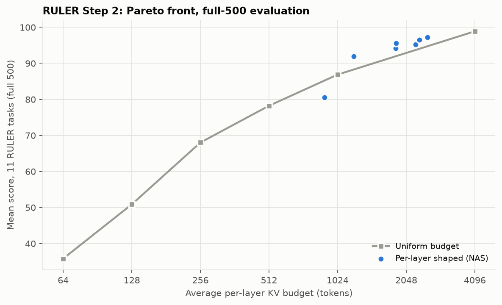
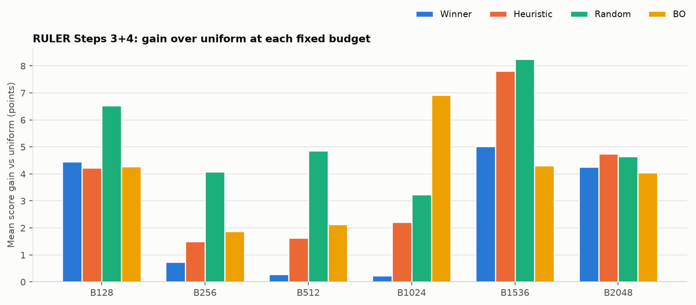
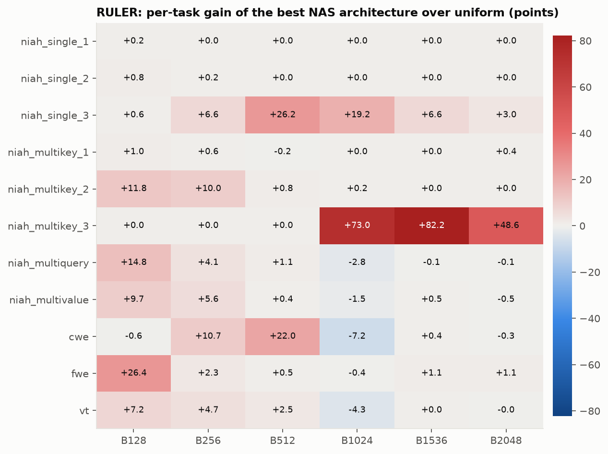
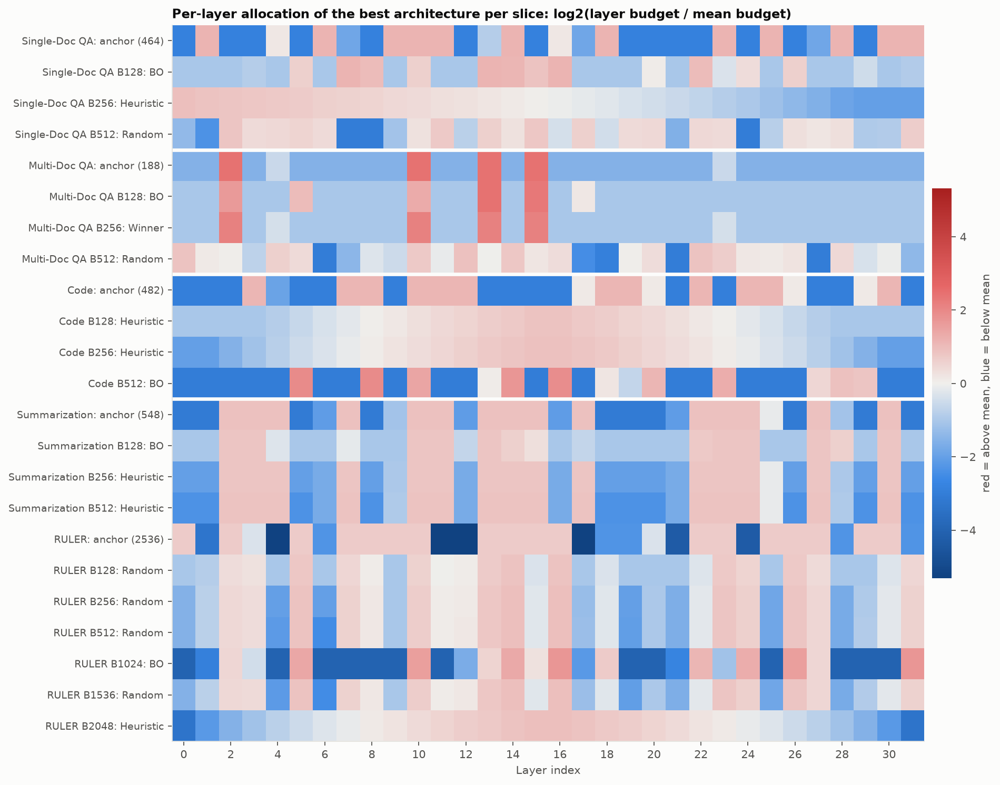

# AdaKV: complete NAS results (LongBench + RULER)

_Generated 2026-10-08 by `ADAKV_RESULTS/generate_adakv_report.py` from the raw result files; re-run the script to refresh. Model: Meta-Llama-3-8B-Instruct (32 layers). Eviction method: AdaKV._

## Contents
1. [Pipeline and status](#1-pipeline-and-status)
2. [LongBench Step 1: search archives](#2-longbench-step-1-unconstrained-search-archives)
3. [LongBench Step 2: Pareto front on full data](#3-longbench-step-2-pareto-front-re-evaluated-on-full-data)
4. [LongBench Steps 3+4: fixed-budget slices](#4-longbench-steps-34-fixed-budget-slices)
5. [RULER results](#5-ruler-results)
6. [Per-layer allocation shapes](#6-per-layer-allocation-shapes)
7. [Caveats and data-quality notes](#7-caveats-and-data-quality-notes)
8. [Source files](#8-source-files)

## 1. Pipeline and status

| Step | What it does | Output |
|---|---|---|
| 1 | Unconstrained multi-objective NAS (LAMP), minimise avg budget and maximise calibration score (30% sample) | `<CAT>/adakv/output.txt` |
| 2 | Re-evaluate every Pareto-optimal config on the full benchmark; extract the best shaped config as the **winner anchor** | `<CAT>/adakv/top_configs/summary_*.json`, `anchors/anchor_adakv_<budget>.txt` |
| 3 | Rescale the winner anchor to fixed mean budgets (128/256/512...) and compare with uniform | arch 1 vs arch 2 in the slice tables |
| 4 | Budget-constrained NAS at each fixed mean budget, then full-eval 5 architectures: Uniform, Winner, best Heuristic, best Random, best BO | `<CAT>_B<T>/adakv/top_configs/eval_results.csv` |

| Benchmark / category | Step 1 | Step 2 | Steps 3+4 |
|---|---|---|---|
| LongBench Single-Doc QA | Done, 450 configs | Done, 16 Pareto configs | B128 (141 search rows), B256 (147 search rows), B512 (253 search rows) |
| LongBench Multi-Doc QA | Done, 400 configs | Done, 17 Pareto configs | B128 (166 search rows), B256 (1000 search rows), B512 (212 search rows) |
| LongBench Code | Done, 149 configs | Done, 14 Pareto configs | B128 (97 search rows), B256 (359 search rows), B512 (307 search rows) |
| LongBench Summarization | Done, 222 configs | Done, 18 Pareto configs | B128 (100 search rows), B256 (101 search rows), B512 (104 search rows) |
| RULER (11 tasks) | Done, 100 configs (`../NAS_Assets/RULER_ALL_4096/`) | Done, 13 Pareto configs | B64 (Step 3 only), B128 (204), B256 (108), B512 (206), B1024 (256), B1536 (199), B2048 (194) |

## 2. LongBench Step 1: unconstrained search archives

| Category | Datasets | Configs evaluated | Pareto-optimal (distinct) | Per-layer budget grid | Best calibration score |
|---|---|---|---|---|---|
| Single-Doc QA | narrativeqa, qasper, multifieldqa_en | 450 | 16 | {64..1024} (5 options) | 38.48 |
| Multi-Doc QA | hotpotqa, 2wikimqa, musique | 400 | 17 | {64..1024} (5 options) | 37.36 |
| Code | lcc, repobench-p | 149 | 14 | {64..1024} (5 options) | 62.62 |
| Summarization | gov_report, qmsum, multi_news | 222 | 18 | {64..1024} (5 options) | 24.63 |

## 3. LongBench Step 2: Pareto front re-evaluated on full data

### Single-Doc QA
_Source: `SINGLE_DOCUMENT_QA/adakv/top_configs/summary_20260803_201801.json`_

| # | Avg budget | Type | narrativeqa | qasper | multifieldqa_en | **Avg score** | Eval time (h) |
|---|---|---|---|---|---|---|---|
| 0 | 64 | uniform | 18.64 | 30.49 | 43.63 | **30.92** | 0.59 |
| 1 | 68 | shaped | 18.08 | 30.77 | 43.31 | **30.72** | 0.61 |
| 2 | 70 | shaped | 17.58 | 31.62 | 44.94 | **31.38** | 0.62 |
| 3 | 78 | shaped | 17.72 | 32.87 | 45.75 | **32.11** | 0.59 |
| 4 | 80 | shaped | 18.80 | 32.04 | 44.77 | **31.87** | 0.60 |
| 5 | 82 | shaped | 19.87 | 32.76 | 44.90 | **32.51** | 0.58 |
| 6 | 100 | shaped | 19.80 | 35.22 | 45.74 | **33.59** | 0.56 |
| 7 | 110 | shaped | 18.94 | 36.75 | 46.24 | **33.98** | 0.53 |
| 8 | 132 | shaped | 20.40 | 36.15 | 46.09 | **34.21** | 0.48 |
| 9 | 136 | shaped | 20.48 | 36.16 | 46.23 | **34.29** | 0.30 |
| 10 | 168 | shaped | 20.78 | 38.90 | 46.57 | **35.42** | 0.25 |
| 11 | 184 | shaped | 20.84 | 38.78 | 47.49 | **35.70** | 0.25 |
| 12 | 214 | shaped | 20.09 | 39.35 | 46.36 | **35.27** | 0.25 |
| 13 | 244 | shaped | 21.65 | 39.49 | 48.05 | **36.40** | 0.25 |
| 14 | 360 | shaped | 21.04 | 40.12 | 47.68 | **36.28** | 0.26 |
| 15 | 464 | shaped | 20.36 | 40.29 | 47.52 | **36.06** | 0.26 |

Best shaped config: **36.40 at avg budget 244**.
Winner anchor extracted for Steps 3+4: `anchors/anchor_adakv_464.txt` = `64 1024 64 64 512 64 1024 128 64 1024 1024 1024 64 256 1024 64 512 128 1024 64 64 64 64 1024 64 1024 64 128 1024 64 1024 1024`

### Multi-Doc QA
_Source: `MULTI_DOCUMENT_QA/adakv/top_configs/summary_20260804_011245.json`_

| # | Avg budget | Type | hotpotqa | 2wikimqa | musique | **Avg score** | Eval time (h) |
|---|---|---|---|---|---|---|---|
| 0 | 64 | uniform | 44.05 | 34.54 | 21.14 | **33.24** | 0.54 |
| 1 | 68 | shaped | 45.24 | 35.12 | 21.79 | **34.05** | 0.50 |
| 2 | 70 | shaped | 44.48 | 35.17 | 21.93 | **33.86** | 0.26 |
| 3 | 74 | shaped | 45.53 | 35.47 | 22.15 | **34.38** | 0.26 |
| 4 | 84 | shaped | 45.60 | 34.89 | 22.37 | **34.29** | 0.26 |
| 5 | 88 | shaped | 46.00 | 36.16 | 22.31 | **34.82** | 0.26 |
| 6 | 102 | shaped | 46.27 | 36.71 | 22.82 | **35.27** | 0.26 |
| 7 | 118 | shaped | 46.34 | 36.90 | 23.23 | **35.49** | 0.26 |
| 8 | 130 | shaped | 46.64 | 36.79 | 23.10 | **35.51** | 0.26 |
| 9 | 138 | shaped | 46.69 | 36.58 | 23.10 | **35.46** | 0.26 |
| 10 | 142 | shaped | 46.69 | 36.58 | 23.14 | **35.47** | 0.26 |
| 11 | 154 | shaped | 47.31 | 36.46 | 23.11 | **35.63** | 0.26 |
| 12 | 158 | shaped | 47.36 | 36.43 | 23.45 | **35.75** | 0.26 |
| 13 | 172 | shaped | 46.65 | 36.96 | 23.42 | **35.68** | 0.26 |
| 14 | 174 | shaped | 47.61 | 36.89 | 23.20 | **35.90** | 0.26 |
| 15 | 178 | shaped | 46.89 | 36.90 | 23.42 | **35.74** | 0.26 |
| 16 | 188 | shaped | 47.32 | 37.03 | 22.85 | **35.73** | 0.26 |

Best shaped config: **35.90 at avg budget 174**.
Winner anchor extracted for Steps 3+4: `anchors/anchor_adakv_188.txt` = `64 64 1024 64 128 64 64 64 64 64 1024 64 64 1024 64 1024 64 64 64 64 64 64 64 128 64 64 64 64 64 64 64 64`

### Code
_Source: `CODE/adakv/top_configs/summary_20260904_174909.csv`_

| # | Avg budget | Type | lcc | repobench-p | **Avg score** | Eval time (h) |
|---|---|---|---|---|---|---|
| 0 | 64 | uniform | 56.36 | 54.44 | **55.40** | 1.54 |
| 1 | 128 | uniform | 59.83 | 54.77 | **57.30** | 1.26 |
| 2 | 216 | shaped | 59.78 | 56.30 | **58.04** | 1.31 |
| 3 | 228 | shaped | 60.16 | 55.83 | **57.99** | 1.32 |
| 4 | 278 | shaped | 59.14 | 56.03 | **57.59** | 1.42 |
| 5 | 282 | shaped | 60.28 | 56.06 | **58.17** | 1.31 |
| 6 | 294 | shaped | 61.40 | 57.08 | **59.24** | 1.20 |
| 7 | 318 | shaped | 60.46 | 56.61 | **58.53** | 1.41 |
| 8 | 322 | shaped | 60.18 | 56.85 | **58.52** | 1.34 |
| 9 | 338 | shaped | 61.15 | 58.54 | **59.84** | 1.24 |
| 10 | 384 | shaped | 60.88 | 56.48 | **58.68** | 1.11 |
| 11 | 396 | shaped | 62.21 | 58.88 | **60.55** | 1.37 |
| 12 | 470 | shaped | 62.60 | 57.87 | **60.23** | 1.17 |
| 13 | 482 | shaped | 61.47 | 57.98 | **59.72** | 1.31 |

Best shaped config: **60.55 at avg budget 396**.
Winner anchor extracted for Steps 3+4: `anchors/anchor_adakv_482.txt` = `64 64 64 1024 128 64 64 1024 1024 64 1024 1024 1024 64 64 64 64 512 1024 1024 512 64 1024 64 1024 1024 512 64 64 512 1024 64`

### Summarization
_Source: `SUMMARIZATION/adakv/top_configs/summary_20261004_061525.json`_

| # | Avg budget | Type | gov_report | qmsum | multi_news | **Avg score** | Eval time (h) |
|---|---|---|---|---|---|---|---|
| 0 | 64 | uniform | 20.27 | 19.87 | 20.52 | **20.22** | 1.77 |
| 1 | 102 | shaped | 20.52 | 20.59 | 21.00 | **20.70** | 1.77 |
| 2 | 112 | shaped | 20.79 | 20.70 | 20.73 | **20.74** | 1.79 |
| 3 | 128 | uniform | 21.57 | 21.26 | 22.32 | **21.72** | 1.67 |
| 4 | 134 | shaped | 21.50 | 21.02 | 21.89 | **21.47** | 1.81 |
| 5 | 186 | shaped | 21.37 | 21.00 | 22.66 | **21.68** | 1.70 |
| 6 | 232 | shaped | 22.35 | 21.86 | 23.48 | **22.56** | 1.72 |
| 7 | 252 | shaped | 22.93 | 21.38 | 23.89 | **22.73** | 1.71 |
| 8 | 256 | shaped | 23.01 | 21.87 | 24.31 | **23.06** | 1.69 |
| 9 | 316 | shaped | 23.43 | 21.60 | 24.86 | **23.30** | 1.64 |
| 10 | 342 | shaped | 23.39 | 21.49 | 24.55 | **23.14** | 1.72 |
| 11 | 360 | shaped | 23.34 | 21.97 | 24.68 | **23.33** | 1.72 |
| 12 | 370 | shaped | 23.64 | 21.98 | 25.36 | **23.66** | 1.65 |
| 13 | 374 | shaped | 23.90 | 21.71 | 25.17 | **23.59** | 1.66 |
| 14 | 468 | shaped | 24.12 | 22.46 | 25.56 | **24.05** | 1.67 |
| 15 | 492 | shaped | 24.52 | 22.16 | 25.40 | **24.03** | 1.69 |
| 16 | 548 | shaped | 25.28 | 22.08 | 25.84 | **24.40** | 1.73 |
| 17 | 1024 | uniform | 25.62 | 22.34 | 26.61 | **24.86** | 1.66 |

Best shaped config: **24.40 at avg budget 548**; the uniform config at 1024 scores 24.86.
Winner anchor extracted for Steps 3+4: `anchors/anchor_adakv_548.txt` = `64 64 1024 1024 1024 64 128 1024 64 256 1024 1024 128 1024 1024 1024 128 1024 64 64 64 128 1024 1024 1024 512 64 1024 256 64 1024 64`

## 4. LongBench Steps 3+4: fixed-budget slices

Architectures: **1 Uniform** (all layers = target), **2 Winner** (Step-2 anchor rescaled to the target, i.e. Step 3), **3 Best heuristic** (best hand-designed shape: ramps/triangles/alternating), **4 Best random**, **5 Best BO** (best config found by the budget-constrained search). Every architecture has exactly the same mean budget.

### Summary: mean score per architecture

| Category | Budget | Search rows | Uniform | Winner | Heuristic | Random | BO | Best | Gain vs uniform |
|---|---|---|---|---|---|---|---|---|---|
| Single-Doc QA | 128 | 141 | 32.83 | 33.16 | 34.63 | 34.60 | **34.64** | BO | +1.82 |
| Single-Doc QA | 256 | 147 | 35.08 | 35.33 | **35.98** | 35.26 | 35.00 | Heuristic | +0.90 |
| Single-Doc QA | 512 | 253 | **36.68** | 36.45 | 35.22 | 36.49 | 36.28 | Uniform | +0.00 |
| Multi-Doc QA | 128 | 166 | 34.99 | 35.38 | 35.19 | 35.37 | **35.96** | BO | +0.97 |
| Multi-Doc QA | 256 | 1000 | 35.42 | **36.14** | 35.71 | 35.95 | 36.05 | Winner | +0.72 |
| Multi-Doc QA | 512 | 212 | 36.14 | 35.69 | 36.04 | **36.33** | 35.33 | Random | +0.19 |
| Code | 128 | 97 | 57.30 | 56.94 | **58.28** | 57.38 | 57.48 | Heuristic | +0.98 |
| Code | 256 | 359 | 58.19 | 58.78 | **59.62** | 59.10 | 58.95 | Heuristic | +1.44 |
| Code | 512 | 307 | 58.70 | 59.61 | 60.30 | 60.62 | **60.68** | BO | +1.98 |
| Summarization | 128 | 100 | 21.72 | 21.47 | 21.84 | 21.73 | **22.05** | BO | +0.34 |
| Summarization | 256 | 101 | 22.72 | 22.68 | **23.00** | 22.53 | 22.64 | Heuristic | +0.28 |
| Summarization | 512 | 104 | 23.62 | 23.85 | **24.08** | 23.89 | 23.76 | Heuristic | +0.46 |

### Per-dataset detail

**Single-Doc QA, B128**  (`SINGLE_DOCUMENT_QA_B128/adakv/top_configs/eval_results.csv`)

| Arch | narrativeqa | qasper | multifieldqa_en | Mean | Per-layer budgets |
|---|---|---|---|---|---|
| Uniform | 18.60 | 34.52 | 45.36 | 32.83 | `128 128 128 128 128 128 128 128 128 128 128 128 128 128 128 128 128 128 128 128 128 128 128 128 128 128 128 128 128 128 128 128` |
| Winner (rescaled anchor) | 18.75 | 34.75 | 45.98 | 33.16 | `64 226 64 64 119 64 226 64 64 226 226 226 64 65 225 64 119 64 225 64 64 64 64 225 64 225 64 64 225 64 225 225` |
| Best heuristic | 19.76 | 36.84 | 47.30 | 34.63 | `64 64 64 64 70 84 99 113 128 142 157 171 185 200 214 229 229 214 200 185 171 157 142 128 113 99 84 70 64 64 64 64` |
| Best random | 19.50 | 37.14 | 47.17 | 34.60 | `64 71 163 156 64 217 64 176 132 64 187 126 132 203 228 104 228 64 103 64 64 64 106 212 184 64 210 169 64 64 107 178` |
| Best BO | 19.39 | 37.49 | 47.05 | 34.64 | `64 64 64 72 64 193 64 283 249 64 194 64 64 283 275 230 283 64 64 64 132 64 255 103 163 64 195 64 64 93 64 69` |

**Single-Doc QA, B256**  (`SINGLE_DOCUMENT_QA_B256/adakv/top_configs/eval_results.csv`)

| Arch | narrativeqa | qasper | multifieldqa_en | Mean | Per-layer budgets |
|---|---|---|---|---|---|
| Uniform | 20.09 | 39.10 | 46.04 | 35.08 | `256 256 256 256 256 256 256 256 256 256 256 256 256 256 256 256 256 256 256 256 256 256 256 256 256 256 256 256 256 256 256 256` |
| Winner (rescaled anchor) | 19.76 | 38.77 | 47.45 | 35.33 | `64 527 64 64 277 64 527 90 64 527 527 527 64 152 527 64 277 90 527 64 64 64 64 527 64 526 64 90 526 64 526 526` |
| Best heuristic | 20.69 | 40.46 | 46.78 | 35.98 | `482 467 453 438 423 408 394 379 364 350 335 320 305 291 276 261 246 232 217 202 187 173 158 143 129 114 99 84 70 64 64 64` |
| Best random | 19.79 | 39.63 | 46.36 | 35.26 | `264 312 194 94 130 268 129 436 469 283 430 110 82 225 300 320 99 287 465 375 308 127 282 118 278 168 277 407 64 64 385 442` |
| Best BO | 19.63 | 39.66 | 45.70 | 35.00 | `64 64 64 64 64 383 64 64 571 1384 64 64 64 472 1634 753 64 64 596 64 113 64 64 64 78 301 64 64 64 64 563 64` |

**Single-Doc QA, B512**  (`SINGLE_DOCUMENT_QA_B512/adakv/top_configs/eval_results.csv`)

| Arch | narrativeqa | qasper | multifieldqa_en | Mean | Per-layer budgets |
|---|---|---|---|---|---|
| Uniform | 21.32 | 41.86 | 46.87 | 36.68 | `512 512 512 512 512 512 512 512 512 512 512 512 512 512 512 512 512 512 512 512 512 512 512 512 512 512 512 512 512 512 512 512` |
| Winner (rescaled anchor) | 20.93 | 40.60 | 47.83 | 36.45 | `119 1063 119 119 559 119 1063 182 119 1062 1062 1062 119 308 1062 119 559 182 1062 119 119 119 119 1062 119 1062 119 182 1062 119 1062 1062` |
| Best heuristic | 20.09 | 40.24 | 45.34 | 35.22 | `154 870 154 870 154 870 154 870 154 870 154 870 154 870 154 870 154 870 154 870 154 870 154 870 154 870 154 870 154 870 154 870` |
| Best random | 20.65 | 41.74 | 47.07 | 36.49 | `202 101 906 669 687 741 677 64 64 240 618 858 298 767 610 864 393 779 383 667 698 171 691 669 64 293 638 581 635 271 278 807` |
| Best BO | 20.62 | 41.83 | 46.38 | 36.28 | `420 64 1374 827 966 368 64 64 64 111 694 1321 1275 321 527 1373 520 240 513 453 342 506 1221 621 64 64 64 219 177 174 1083 290` |

**Multi-Doc QA, B128**  (`MULTI_DOCUMENT_QA_B128/adakv/top_configs/eval_results.csv`)

| Arch | hotpotqa | 2wikimqa | musique | Mean | Per-layer budgets |
|---|---|---|---|---|---|
| Uniform | 45.50 | 36.81 | 22.67 | 34.99 | `128 128 128 128 128 128 128 128 128 128 128 128 128 128 128 128 128 128 128 128 128 128 128 128 128 128 128 128 128 128 128 128` |
| Winner (rescaled anchor) | 46.36 | 36.77 | 23.00 | 35.38 | `64 64 560 64 96 64 64 64 64 64 560 64 64 560 64 560 64 64 64 64 64 64 64 96 64 64 64 64 64 64 64 64` |
| Best heuristic | 46.36 | 37.03 | 22.18 | 35.19 | `230 223 216 209 202 195 188 181 174 167 160 153 146 139 132 125 118 111 104 97 89 82 75 68 64 64 64 64 64 64 64 64` |
| Best random | 45.75 | 37.28 | 23.08 | 35.37 | `64 64 213 145 152 190 134 143 159 194 90 146 64 190 64 180 178 64 64 178 101 172 64 67 173 64 115 174 142 64 206 78` |
| Best BO | 47.98 | 36.80 | 23.10 | 35.96 | `64 64 404 64 64 249 64 64 64 64 316 64 64 695 64 626 64 142 64 64 64 64 64 64 64 64 64 64 64 64 64 64` |

**Multi-Doc QA, B256**  (`MULTI_DOCUMENT_QA_B256/adakv/top_configs/eval_results.csv`)

| Arch | hotpotqa | 2wikimqa | musique | Mean | Per-layer budgets |
|---|---|---|---|---|---|
| Uniform | 46.07 | 37.57 | 22.63 | 35.42 | `256 256 256 256 256 256 256 256 256 256 256 256 256 256 256 256 256 256 256 256 256 256 256 256 256 256 256 256 256 256 256 256` |
| Winner (rescaled anchor) | 47.18 | 38.03 | 23.21 | 36.14 | `127 127 1130 127 193 127 127 127 127 127 1130 127 127 1130 126 1130 126 126 126 126 126 126 126 193 126 126 126 126 126 126 126 126` |
| Best heuristic | 46.80 | 37.70 | 22.63 | 35.71 | `482 467 453 438 423 408 394 379 364 350 335 320 305 291 276 261 246 232 217 202 187 173 158 143 129 114 99 84 70 64 64 64` |
| Best random | 46.85 | 37.71 | 23.29 | 35.95 | `510 218 416 249 73 213 441 376 127 461 395 64 64 468 347 192 275 429 319 64 153 64 81 419 64 424 182 315 98 252 138 301` |
| Best BO | 46.90 | 37.71 | 23.53 | 36.05 | `64 64 1314 64 64 64 64 64 70 64 1070 64 64 2005 64 2005 64 64 64 64 64 64 64 64 64 64 64 64 64 64 64 64` |

**Multi-Doc QA, B512**  (`MULTI_DOCUMENT_QA_B512/adakv/top_configs/eval_results.csv`)

| Arch | hotpotqa | 2wikimqa | musique | Mean | Per-layer budgets |
|---|---|---|---|---|---|
| Uniform | 47.20 | 38.68 | 22.53 | 36.14 | `512 512 512 512 512 512 512 512 512 512 512 512 512 512 512 512 512 512 512 512 512 512 512 512 512 512 512 512 512 512 512 512` |
| Winner (rescaled anchor) | 46.94 | 37.72 | 22.41 | 35.69 | `253 253 2260 253 386 253 253 253 253 253 2260 253 253 2260 253 2260 253 253 253 253 253 253 253 386 253 253 252 252 252 252 252 252` |
| Best heuristic | 47.58 | 37.75 | 22.78 | 36.04 | `972 942 913 883 853 823 794 764 734 705 675 645 616 586 556 526 497 467 437 408 378 348 319 289 259 229 200 170 140 111 81 64` |
| Best random | 47.19 | 39.00 | 22.79 | 36.33 | `914 548 526 312 785 675 64 191 428 353 849 473 949 509 874 581 653 93 70 512 658 64 922 797 574 555 593 64 700 404 497 197` |
| Best BO | 46.50 | 36.85 | 22.65 | 35.33 | `1128 64 1800 1005 1137 782 64 1116 586 64 542 1819 1589 2324 64 64 64 64 64 64 151 64 64 64 64 64 64 64 64 1189 64 64` |

**Code, B128**  (`CODE_B128/adakv/top_configs/eval_results.csv`)

| Arch | lcc | repobench-p | Mean | Per-layer budgets |
|---|---|---|---|---|
| Uniform | 59.83 | 54.77 | 57.30 | `128 128 128 128 128 128 128 128 128 128 128 128 128 128 128 128 128 128 128 128 128 128 128 128 128 128 128 128 128 128 128 128` |
| Winner (rescaled anchor) | 58.66 | 55.21 | 56.94 | `64 64 64 218 64 64 64 218 218 64 218 218 218 64 64 64 64 114 218 218 114 64 218 64 218 218 114 64 64 114 218 64` |
| Best heuristic | 60.44 | 56.13 | 58.28 | `64 64 64 64 70 84 99 113 128 142 157 171 185 200 214 229 229 214 200 185 171 157 142 128 113 99 84 70 64 64 64 64` |
| Best random | 60.01 | 54.76 | 57.38 | `107 203 64 124 165 64 155 197 64 64 189 79 64 118 64 64 164 64 192 208 86 135 195 177 201 136 64 197 175 189 64 64` |
| Best BO | 58.80 | 56.16 | 57.48 | `184 88 64 64 211 64 64 199 64 64 190 190 64 64 64 64 211 64 194 211 99 192 149 178 204 211 64 208 211 70 64 64` |

**Code, B256**  (`CODE_B256/adakv/top_configs/eval_results.csv`)

| Arch | lcc | repobench-p | Mean | Per-layer budgets |
|---|---|---|---|---|
| Uniform | 60.02 | 56.36 | 58.19 | `256 256 256 256 256 256 256 256 256 256 256 256 256 256 256 256 256 256 256 256 256 256 256 256 256 256 256 256 256 256 256 256` |
| Winner (rescaled anchor) | 60.53 | 57.02 | 58.78 | `64 64 64 507 87 64 64 507 507 64 507 507 506 64 64 64 64 267 506 506 267 64 506 64 506 506 267 64 64 267 506 64` |
| Best heuristic | 61.17 | 58.08 | 59.62 | `64 64 86 116 147 177 208 238 268 299 329 359 390 420 450 481 481 450 420 390 359 329 299 268 238 208 177 147 116 86 64 64` |
| Best random | 60.92 | 57.28 | 59.10 | `338 161 64 64 470 160 167 314 180 438 435 321 97 116 433 245 290 231 220 300 178 120 213 410 168 281 339 452 208 358 163 258` |
| Best BO | 60.69 | 57.20 | 58.95 | `64 64 64 64 64 112 64 658 64 64 732 64 739 64 741 64 64 435 709 517 64 64 752 64 64 303 64 770 64 360 148 64` |

**Code, B512**  (`CODE_B512/adakv/top_configs/eval_results.csv`)

| Arch | lcc | repobench-p | Mean | Per-layer budgets |
|---|---|---|---|---|
| Uniform | 61.09 | 56.31 | 58.70 | `512 512 512 512 512 512 512 512 512 512 512 512 512 512 512 512 512 512 512 512 512 512 512 512 512 512 512 512 512 512 512 512` |
| Winner (rescaled anchor) | 61.53 | 57.69 | 59.61 | `115 115 115 1027 175 115 115 1027 1027 115 1027 1027 1027 115 115 115 115 540 1027 1027 540 115 1027 115 1027 1027 540 115 115 540 1027 115` |
| Best heuristic | 61.55 | 59.04 | 60.30 | `64 81 111 140 170 200 229 259 289 319 348 378 408 437 467 497 526 556 586 616 645 675 705 734 764 794 823 853 883 913 942 972` |
| Best random | 62.60 | 58.64 | 60.62 | `681 325 64 64 948 322 336 632 364 882 876 648 195 234 874 494 584 465 443 606 360 241 430 827 339 567 683 910 419 721 329 521` |
| Best BO | 62.71 | 58.65 | 60.68 | `64 64 64 64 64 1936 64 64 1937 64 1383 64 64 528 1692 64 1874 64 581 329 1098 64 64 1242 64 64 64 707 959 902 64 64` |

**Summarization, B128**  (`SUMMARIZATION_B128/adakv/top_configs/eval_results.csv`)

| Arch | gov_report | qmsum | multi_news | Mean | Per-layer budgets |
|---|---|---|---|---|---|
| Uniform | 21.57 | 21.26 | 22.32 | 21.72 | `128 128 128 128 128 128 128 128 128 128 128 128 128 128 128 128 128 128 128 128 128 128 128 128 128 128 128 128 128 128 128 128` |
| Winner (rescaled anchor) | 20.94 | 21.32 | 22.15 | 21.47 | `230 223 216 209 202 195 188 181 174 167 160 153 146 139 132 125 118 111 104 97 89 82 75 68 64 64 64 64 64 64 64 64` |
| Best heuristic | 21.71 | 21.32 | 22.48 | 21.84 | `64 64 198 198 198 64 64 198 64 64 198 198 64 198 198 198 64 198 64 64 64 64 198 198 198 104 64 197 64 64 197 64` |
| Best random | 21.49 | 21.17 | 22.52 | 21.73 | `74 64 64 85 83 197 118 99 112 143 64 142 96 128 184 178 64 216 208 73 205 204 223 213 121 85 194 64 103 137 91 64` |
| Best BO | 22.02 | 21.28 | 22.86 | 22.05 | `64 64 222 222 105 64 64 117 64 64 222 222 81 222 193 158 64 82 64 64 64 64 210 222 222 64 64 222 192 64 222 64` |

**Summarization, B256**  (`SUMMARIZATION_B256/adakv/top_configs/eval_results.csv`)

| Arch | gov_report | qmsum | multi_news | Mean | Per-layer budgets |
|---|---|---|---|---|---|
| Uniform | 22.57 | 21.81 | 23.77 | 22.72 | `256 256 256 256 256 256 256 256 256 256 256 256 256 256 256 256 256 256 256 256 256 256 256 256 256 256 256 256 256 256 256 256` |
| Winner (rescaled anchor) | 22.70 | 21.66 | 23.67 | 22.68 | `64 64 86 116 147 177 208 238 268 299 329 359 390 420 450 481 481 450 420 390 359 329 299 268 238 208 177 147 116 86 64 64` |
| Best heuristic | 23.48 | 21.53 | 23.99 | 23.00 | `64 64 450 450 450 64 77 450 64 130 450 450 77 450 450 450 77 450 64 64 64 77 450 450 450 236 64 449 130 64 449 64` |
| Best random | 22.41 | 21.44 | 23.73 | 22.53 | `411 108 189 64 64 140 477 423 64 380 483 168 145 473 286 64 297 416 64 212 350 491 200 215 185 288 495 88 239 336 280 97` |
| Best BO | 22.82 | 21.25 | 23.86 | 22.64 | `972 64 64 64 64 474 64 243 65 220 977 64 64 950 358 64 64 977 64 64 64 64 64 572 249 64 64 64 64 855 64 64` |

**Summarization, B512**  (`SUMMARIZATION_B512/adakv/top_configs/eval_results.csv`)

| Arch | gov_report | qmsum | multi_news | Mean | Per-layer budgets |
|---|---|---|---|---|---|
| Uniform | 23.88 | 21.86 | 25.12 | 23.62 | `512 512 512 512 512 512 512 512 512 512 512 512 512 512 512 512 512 512 512 512 512 512 512 512 512 512 512 512 512 512 512 512` |
| Winner (rescaled anchor) | 23.96 | 22.12 | 25.47 | 23.85 | `64 112 174 235 296 358 419 481 542 603 665 726 787 849 910 971 971 910 849 787 726 665 603 542 481 419 358 296 235 174 112 64` |
| Best heuristic | 24.63 | 21.94 | 25.68 | 24.08 | `102 102 915 915 915 102 157 915 102 265 915 915 157 915 915 915 157 915 102 102 102 156 915 915 915 482 102 915 265 102 915 102` |
| Best random | 24.23 | 22.26 | 25.18 | 23.89 | `533 628 390 190 262 540 259 879 944 570 867 223 165 454 604 646 199 579 937 756 620 256 568 239 561 339 559 820 66 64 776 891` |
| Best BO | 24.36 | 21.69 | 25.22 | 23.76 | `64 64 1361 985 391 64 64 1361 64 64 1361 929 64 1361 1360 64 64 1349 64 64 64 64 721 64 1361 64 64 1066 64 297 1329 64` |

## 5. RULER results

### Step 2: Pareto front (full 500 samples per task)

| Arch | Avg budget | Type | niah_single_1 | niah_single_2 | niah_single_3 | niah_multikey_1 | niah_multikey_2 | niah_multikey_3 | niah_multiquery | niah_multivalue | cwe | fwe | vt | **Mean** |
|---|---|---|---|---|---|---|---|---|---|---|---|---|---|---|
| 1 | 64 | uniform | 99.6 | 92.0 | 0.0 | 91.6 | 51.6 | 0.0 | 8.2 | 26.7 | 4.0 | 0.7 | 19.4 | **35.81** |
| 2 | 128 | uniform | 99.8 | 97.8 | 0.0 | 97.4 | 68.2 | 0.0 | 44.2 | 65.8 | 15.3 | 16.8 | 54.2 | **50.87** |
| 3 | 256 | uniform | 100.0 | 99.8 | 4.2 | 98.8 | 84.8 | 0.0 | 89.5 | 90.4 | 28.9 | 68.1 | 83.7 | **68.01** |
| 4 | 512 | uniform | 100.0 | 100.0 | 32.6 | 99.6 | 97.4 | 0.0 | 98.5 | 97.3 | 59.0 | 81.9 | 94.2 | **78.22** |
| 7 | 896 | shaped | 100.0 | 99.8 | 43.2 | 99.2 | 95.2 | 0.4 | 97.4 | 96.9 | 73.2 | 86.4 | 94.2 | **80.53** |
| 5 | 1024 | uniform | 100.0 | 100.0 | 77.4 | 99.6 | 99.2 | 1.6 | 99.8 | 98.0 | 93.6 | 87.3 | 98.9 | **86.87** |
| 8 | 1204 | shaped | 100.0 | 100.0 | 97.0 | 99.4 | 100.0 | 48.8 | 99.0 | 98.0 | 90.2 | 84.2 | 95.0 | **91.96** |
| 9 | 1840 | shaped | 100.0 | 100.0 | 98.8 | 99.8 | 98.6 | 94.2 | 98.3 | 97.0 | 82.1 | 74.2 | 93.3 | **94.22** |
| 10 | 1852 | shaped | 100.0 | 100.0 | 99.6 | 99.0 | 100.0 | 89.0 | 98.8 | 96.3 | 92.8 | 78.8 | 96.9 | **95.56** |
| 11 | 2254 | shaped | 100.0 | 99.8 | 99.6 | 99.2 | 99.8 | 85.2 | 98.8 | 96.0 | 90.6 | 80.6 | 97.6 | **95.20** |
| 12 | 2340 | shaped | 100.0 | 100.0 | 100.0 | 99.2 | 99.4 | 92.8 | 98.5 | 98.4 | 93.9 | 83.2 | 96.3 | **96.52** |
| 13 | 2536 | shaped | 100.0 | 100.0 | 100.0 | 99.0 | 99.8 | 98.2 | 98.5 | 96.8 | 97.4 | 83.7 | 96.1 | **97.24** |
| 6 | 4096 | uniform | 100.0 | 100.0 | 100.0 | 99.4 | 100.0 | 98.4 | 99.8 | 98.8 | 99.8 | 92.0 | 99.4 | **98.88** |

Winner anchor: `anchors/anchor_adakv_2536.txt` = `4096 256 4096 2048 64 4096 512 4096 4096 4096 4096 64 64 4096 4096 4096 4096 64 512 512 2048 128 4096 4096 128 4096 4096 4096 512 4096 4096 512`

### Steps 3+4: fixed-budget slices

| Budget | Search rows | Uniform | Winner | Heuristic | Random | BO | Best | Gain vs uniform |
|---|---|---|---|---|---|---|---|---|
| 64 | n/a (Step 3 only) | 35.81 (Step 2) | **35.97** | n/a | n/a | n/a | Winner | +0.16 |
| 128 | 204 | 50.87 | 55.32 | 55.10 | **57.40** | 55.14 | Random | +6.53 |
| 256 | 108 | 68.01 | 68.74 | 69.51 | **72.10** | 69.89 | Random | +4.09 |
| 512 | 206 | 78.22 | 78.50 | 79.85 | **83.08** | 80.35 | Random | +4.85 |
| 1024 | 256 | 86.87 | 87.10 | 89.08 | 90.10 | **93.78** | BO | +6.91 |
| 1536 | 199 | 89.75 | 94.76 | 97.56 | **97.99** | 94.05 | Random | +8.25 |
| 2048 | 194 | 93.90 | 98.17 | **98.65** | 98.56 | 97.96 | Heuristic | +4.75 |

### Per-task detail

**RULER B64**  (`RULER_ALL_B64/adakv/top_configs/eval_results.csv`)

| Arch | niah_single_1 | niah_single_2 | niah_single_3 | niah_multikey_1 | niah_multikey_2 | niah_multikey_3 | niah_multiquery | niah_multivalue | cwe | fwe | vt | Mean | Per-layer budgets |
|---|---|---|---|---|---|---|---|---|---|---|---|---|---|
| Winner (rescaled anchor) | 99.6 | 92.4 | 0.0 | 91.4 | 37.8 | 0.0 | 13.9 | 31.4 | 4.9 | 0.2 | 24.0 | 35.97 | `98 16 98 51 16 98 17 97 97 97 97 16 16 97 97 97 97 16 17 17 51 16 97 97 16 97 97 97 17 97 97 17` |

**RULER B128**  (`RULER_ALL_B128/adakv/top_configs/eval_results.csv`)

| Arch | niah_single_1 | niah_single_2 | niah_single_3 | niah_multikey_1 | niah_multikey_2 | niah_multikey_3 | niah_multiquery | niah_multivalue | cwe | fwe | vt | Mean | Per-layer budgets |
|---|---|---|---|---|---|---|---|---|---|---|---|---|---|
| Uniform | 99.8 | 97.8 | 0.0 | 97.4 | 68.2 | 0.0 | 44.2 | 65.8 | 15.3 | 16.8 | 54.2 | 50.87 | `128 128 128 128 128 128 128 128 128 128 128 128 128 128 128 128 128 128 128 128 128 128 128 128 128 128 128 128 128 128 128 128` |
| Winner (rescaled anchor) | 100.0 | 97.8 | 0.2 | 98.2 | 78.0 | 0.0 | 56.0 | 72.8 | 15.0 | 39.0 | 51.7 | 55.32 | `175 64 175 92 64 175 64 175 175 175 175 64 64 175 175 175 175 64 64 64 92 64 175 174 64 174 174 174 64 174 174 64` |
| Best heuristic | 100.0 | 97.4 | 0.4 | 97.6 | 74.6 | 0.0 | 51.8 | 63.7 | 11.5 | 47.5 | 61.6 | 55.10 | `64 64 64 64 70 84 99 113 128 142 157 171 185 200 214 229 229 214 200 185 171 157 142 128 113 99 84 70 64 64 64 64` |
| Best random | 100.0 | 98.6 | 0.6 | 98.4 | 80.0 | 0.0 | 59.0 | 75.5 | 14.7 | 43.2 | 61.5 | 57.40 | `64 71 163 156 64 217 64 176 132 64 187 126 132 203 228 104 228 64 103 64 64 64 106 212 184 64 210 169 64 64 107 178` |
| Best BO | 100.0 | 98.0 | 1.8 | 98.4 | 76.0 | 0.0 | 51.1 | 66.8 | 10.8 | 41.0 | 62.6 | 55.14 | `64 64 64 64 64 64 64 102 64 64 420 64 217 76 191 183 507 64 64 64 64 64 64 281 89 64 133 64 64 284 333 64` |

**RULER B256**  (`RULER_ALL_B256/adakv/top_configs/eval_results.csv`)

| Arch | niah_single_1 | niah_single_2 | niah_single_3 | niah_multikey_1 | niah_multikey_2 | niah_multikey_3 | niah_multiquery | niah_multivalue | cwe | fwe | vt | Mean | Per-layer budgets |
|---|---|---|---|---|---|---|---|---|---|---|---|---|---|
| Uniform | 100.0 | 99.8 | 4.2 | 98.8 | 84.8 | 0.0 | 89.5 | 90.4 | 28.9 | 68.1 | 83.7 | 68.01 | `256 256 256 256 256 256 256 256 256 256 256 256 256 256 256 256 256 256 256 256 256 256 256 256 256 256 256 256 256 256 256 256` |
| Winner (rescaled anchor) | 100.0 | 100.0 | 8.4 | 99.6 | 94.2 | 0.0 | 92.1 | 94.0 | 26.8 | 65.3 | 75.8 | 68.74 | `389 64 389 205 64 389 67 389 389 389 389 64 64 389 389 389 389 64 67 66 205 64 389 389 64 389 389 389 66 389 389 66` |
| Best heuristic | 100.0 | 99.6 | 7.4 | 99.4 | 90.6 | 0.0 | 92.0 | 89.1 | 26.6 | 67.4 | 92.5 | 69.51 | `64 64 86 116 147 177 208 238 268 299 329 359 390 420 450 481 481 450 420 390 359 329 299 268 238 208 177 147 116 86 64 64` |
| Best random | 100.0 | 100.0 | 10.8 | 99.4 | 94.8 | 0.0 | 93.5 | 96.0 | 39.7 | 70.4 | 88.4 | 72.10 | `86 151 346 331 64 460 64 373 281 125 396 266 279 430 484 220 484 108 217 64 129 82 224 449 389 71 445 359 77 136 226 376` |
| Best BO | 100.0 | 100.0 | 13.4 | 99.6 | 92.6 | 0.0 | 89.7 | 90.3 | 34.3 | 65.1 | 83.9 | 69.89 | `64 64 438 421 64 542 64 162 262 64 541 101 64 542 542 64 542 64 64 99 64 64 334 64 542 64 542 542 64 64 539 541` |

**RULER B512**  (`RULER_ALL_B512/adakv/top_configs/eval_results.csv`)

| Arch | niah_single_1 | niah_single_2 | niah_single_3 | niah_multikey_1 | niah_multikey_2 | niah_multikey_3 | niah_multiquery | niah_multivalue | cwe | fwe | vt | Mean | Per-layer budgets |
|---|---|---|---|---|---|---|---|---|---|---|---|---|---|
| Uniform | 100.0 | 100.0 | 32.6 | 99.6 | 97.4 | 0.0 | 98.5 | 97.3 | 59.0 | 81.9 | 94.2 | 78.22 | `512 512 512 512 512 512 512 512 512 512 512 512 512 512 512 512 512 512 512 512 512 512 512 512 512 512 512 512 512 512 512 512` |
| Winner (rescaled anchor) | 100.0 | 100.0 | 46.2 | 98.8 | 98.2 | 0.0 | 98.0 | 97.2 | 62.7 | 71.6 | 90.8 | 78.50 | `799 89 799 420 64 799 137 799 799 799 799 64 64 799 799 799 799 64 137 137 420 66 799 799 66 799 799 799 137 799 799 137` |
| Best heuristic | 100.0 | 99.8 | 45.6 | 99.6 | 97.6 | 0.0 | 99.1 | 97.5 | 60.3 | 80.8 | 98.0 | 79.85 | `64 112 174 235 296 358 419 481 542 603 665 726 787 849 910 971 971 910 849 787 726 665 603 542 481 419 358 296 235 174 112 64` |
| Best random | 100.0 | 100.0 | 58.8 | 99.4 | 98.2 | 0.0 | 99.6 | 97.8 | 81.0 | 82.4 | 96.6 | 83.08 | `173 303 695 663 115 924 90 748 563 252 796 535 560 863 971 441 970 217 436 125 259 164 450 900 782 142 892 720 154 273 453 755` |
| Best BO | 100.0 | 100.0 | 82.6 | 99.2 | 98.6 | 1.4 | 91.4 | 90.0 | 55.4 | 70.1 | 95.2 | 80.35 | `64 1280 436 64 64 730 64 1134 64 294 617 332 569 64 1516 120 1645 64 64 64 130 64 64 1645 1581 64 64 1645 64 64 1618 132` |

**RULER B1024**  (`RULER_ALL_B1024/adakv/top_configs/eval_results.csv`)

| Arch | niah_single_1 | niah_single_2 | niah_single_3 | niah_multikey_1 | niah_multikey_2 | niah_multikey_3 | niah_multiquery | niah_multivalue | cwe | fwe | vt | Mean | Per-layer budgets |
|---|---|---|---|---|---|---|---|---|---|---|---|---|---|
| Uniform | 100.0 | 100.0 | 77.4 | 99.6 | 99.2 | 1.6 | 99.8 | 98.0 | 93.6 | 87.3 | 98.9 | 86.87 | `1024 1024 1024 1024 1024 1024 1024 1024 1024 1024 1024 1024 1024 1024 1024 1024 1024 1024 1024 1024 1024 1024 1024 1024 1024 1024 1024 1024 1024 1024 1024 1024` |
| Winner (rescaled anchor) | 100.0 | 100.0 | 88.6 | 99.6 | 99.2 | 6.8 | 99.2 | 98.5 | 92.1 | 79.9 | 94.2 | 87.10 | `1602 179 1602 844 108 1602 274 1602 1602 1602 1602 108 108 1602 1602 1602 1602 108 274 274 843 132 1602 1602 132 1602 1602 1602 274 1602 1602 274` |
| Best heuristic | 100.0 | 100.0 | 89.8 | 99.6 | 99.8 | 13.4 | 99.8 | 98.2 | 92.1 | 88.3 | 99.0 | 89.08 | `102 225 348 471 594 717 840 963 1085 1208 1331 1454 1577 1700 1823 1946 1946 1823 1700 1577 1454 1331 1208 1085 963 840 717 594 471 348 225 102` |
| Best random | 100.0 | 100.0 | 95.0 | 99.8 | 100.0 | 14.2 | 99.8 | 98.5 | 97.2 | 87.7 | 98.9 | 90.10 | `345 605 1390 1327 230 1848 180 1496 1126 503 1591 1070 1120 1725 1942 882 1941 435 872 250 519 327 901 1800 1563 285 1785 1439 308 546 906 1511` |
| Best BO | 100.0 | 100.0 | 96.6 | 99.6 | 99.4 | 74.6 | 97.0 | 96.5 | 86.4 | 86.9 | 94.6 | 93.78 | `64 138 1424 750 64 2702 64 64 64 64 3042 64 318 1446 2629 1224 3329 227 1630 64 64 152 2223 459 2494 64 3014 1406 64 64 64 3329` |

**RULER B1536**  (`RULER_ALL_B1536/adakv/top_configs/eval_results.csv`)

| Arch | niah_single_1 | niah_single_2 | niah_single_3 | niah_multikey_1 | niah_multikey_2 | niah_multikey_3 | niah_multiquery | niah_multivalue | cwe | fwe | vt | Mean | Per-layer budgets |
|---|---|---|---|---|---|---|---|---|---|---|---|---|---|
| Uniform | 100.0 | 100.0 | 91.2 | 99.6 | 100.0 | 10.6 | 99.9 | 98.3 | 98.7 | 89.7 | 99.1 | 89.75 | `1536 1536 1536 1536 1536 1536 1536 1536 1536 1536 1536 1536 1536 1536 1536 1536 1536 1536 1536 1536 1536 1536 1536 1536 1536 1536 1536 1536 1536 1536 1536 1536` |
| Winner (rescaled anchor) | 100.0 | 100.0 | 97.6 | 99.6 | 99.8 | 67.6 | 99.5 | 98.7 | 96.9 | 86.8 | 95.8 | 94.76 | `2403 269 2403 1265 162 2403 411 2403 2403 2403 2403 162 162 2403 2403 2403 2403 162 411 411 1265 198 2403 2403 198 2403 2403 2403 411 2403 2403 411` |
| Best heuristic | 100.0 | 100.0 | 98.8 | 99.8 | 100.0 | 88.0 | 99.8 | 98.0 | 98.2 | 91.3 | 99.2 | 97.56 | `154 338 522 707 891 1075 1260 1444 1628 1812 1997 2181 2365 2550 2734 2918 2918 2734 2550 2365 2181 1997 1812 1628 1444 1260 1075 891 707 522 338 154` |
| Best random | 100.0 | 100.0 | 97.8 | 99.6 | 100.0 | 92.8 | 99.8 | 98.8 | 99.2 | 90.8 | 99.1 | 97.99 | `518 908 2085 1990 346 2772 271 2244 1689 755 2387 1604 1680 2588 2912 1323 2911 652 1308 375 778 491 1351 2700 2344 427 2677 2159 463 819 1359 2266` |
| Best BO | 100.0 | 100.0 | 90.4 | 99.6 | 99.8 | 73.4 | 98.8 | 98.3 | 87.1 | 89.6 | 97.6 | 94.05 | `118 3277 1797 2309 16 3729 16 813 135 1102 2998 16 921 2067 3525 1566 3730 3729 1529 16 16 202 1123 3730 3729 16 3707 147 16 16 174 2867` |

**RULER B2048**  (`RULER_ALL_B2048/adakv/top_configs/eval_results.csv`)

| Arch | niah_single_1 | niah_single_2 | niah_single_3 | niah_multikey_1 | niah_multikey_2 | niah_multikey_3 | niah_multiquery | niah_multivalue | cwe | fwe | vt | Mean | Per-layer budgets |
|---|---|---|---|---|---|---|---|---|---|---|---|---|---|
| Uniform | 100.0 | 100.0 | 96.6 | 99.4 | 100.0 | 48.8 | 99.9 | 98.5 | 99.6 | 90.9 | 99.3 | 93.90 | `2048 2048 2048 2048 2048 2048 2048 2048 2048 2048 2048 2048 2048 2048 2048 2048 2048 2048 2048 2048 2048 2048 2048 2048 2048 2048 2048 2048 2048 2048 2048 2048` |
| Winner (rescaled anchor) | 100.0 | 100.0 | 100.0 | 99.6 | 99.4 | 98.0 | 99.5 | 98.7 | 98.6 | 88.8 | 97.2 | 98.17 | `3204 358 3204 1687 216 3204 548 3204 3204 3204 3204 216 216 3204 3204 3204 3204 216 548 548 1687 264 3204 3204 264 3204 3204 3204 548 3204 3204 548` |
| Best heuristic | 100.0 | 100.0 | 99.6 | 99.8 | 100.0 | 97.4 | 99.8 | 98.0 | 99.3 | 91.9 | 99.2 | 98.65 | `205 451 696 942 1188 1434 1679 1925 2171 2417 2662 2908 3154 3400 3645 3891 3891 3645 3400 3154 2908 2662 2417 2171 1925 1679 1434 1188 942 696 451 205` |
| Best random | 100.0 | 100.0 | 98.2 | 99.6 | 100.0 | 97.0 | 100.0 | 98.9 | 99.5 | 91.7 | 99.3 | 98.56 | `691 1211 2781 2653 461 3696 361 2992 2252 1006 3183 2139 2241 3451 3883 1764 3881 870 1744 499 1037 654 1802 3600 3126 569 3569 2878 617 1092 1812 3021` |
| Best BO | 100.0 | 100.0 | 99.8 | 99.8 | 100.0 | 95.8 | 99.8 | 98.2 | 97.6 | 88.1 | 98.4 | 97.96 | `456 456 455 4096 455 4096 455 455 455 455 4096 455 4096 455 4096 4096 4096 455 4096 455 455 455 4096 455 4096 4096 4096 4096 455 4096 455 455` |

## 6. Per-layer allocation shapes

Each row is the best architecture in a slice (or a winner anchor), shown as log2(layer budget / mean budget): red layers get more than the mean, blue layers less, grey is exactly the mean.

## 7. Caveats and data-quality notes

- **LongBench vs RULER search spaces.** LongBench Step 1 used per-layer budgets {64..1024}; RULER Step 1 used {64..4096}.
- **Summarization Step 1 was rerun.** Its original run searched per-layer budgets up to 4096 instead of 1024 (the space used by the other three LongBench categories); the results here are from a corrected rerun on the {64..1024} grid, matching the others. The original 4096-grid archive was kept for reference (`SUMMARIZATION/adakv_old/`), not deleted.
- **Code Step 1 is partial (149 configs).** Its Step-2 table uses `summary_20260904_174909.csv`, which adds the recovered avg_budget=482 config (the Code winner anchor).
- **Minimum per-layer budget.** All LongBench slices and RULER B128/B256/B512 used a floor of 64. RULER B1024, B1536 and B2048 searched with a floor of 16 (launched before `run_ruler_lamp.py` switched 16 to 64), and RULER B64 (winner rescale only) used 16.
- **Search budgets vary.** Most slice searches were accepted at 100-360 rows rather than the nominal 1000 (only Multi-Doc QA B256 reached 1000) because of repeated crashes caused by other jobs on the shared GPUs.
- **Scores are rounded as stored.** Differences under ~0.3 points between architectures are within run-to-run noise and should not be over-interpreted.

## 8. Source files

| What | Path (relative to `NAS_Assets_SNAP_NAS/`) |
|---|---|
| Step-1 archives | `<CAT>/adakv/output.txt` |
| Step-2 summaries | `<CAT>/adakv/top_configs/summary_*.json` / `.csv` |
| Winner anchors | `anchors/anchor_adakv_{464,188,482,548,2536}.txt` |
| LongBench slices | `<CAT>_B{128,256,512}/adakv/top_configs/eval_results.csv` |
| RULER Step 2 | `RULER_ALL/adakv/top_configs/eval_results_total.csv` |
| RULER slices | `RULER_ALL_B{64,128,256,512,1024,1536,2048}/adakv/top_configs/eval_results.csv` |
| Slice run log / incidents | `LONGBENCH_STEP4_QUEUE.md`, `RULER_NAS_RUNBOOK.md` |
| Flat CSV exports (this folder) | `ADAKV_RESULTS/data/*.csv` |
